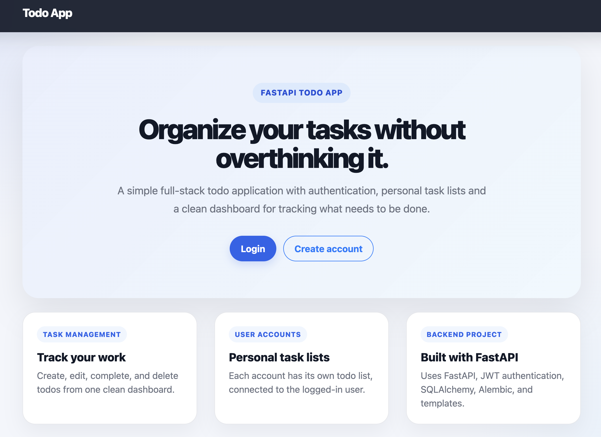
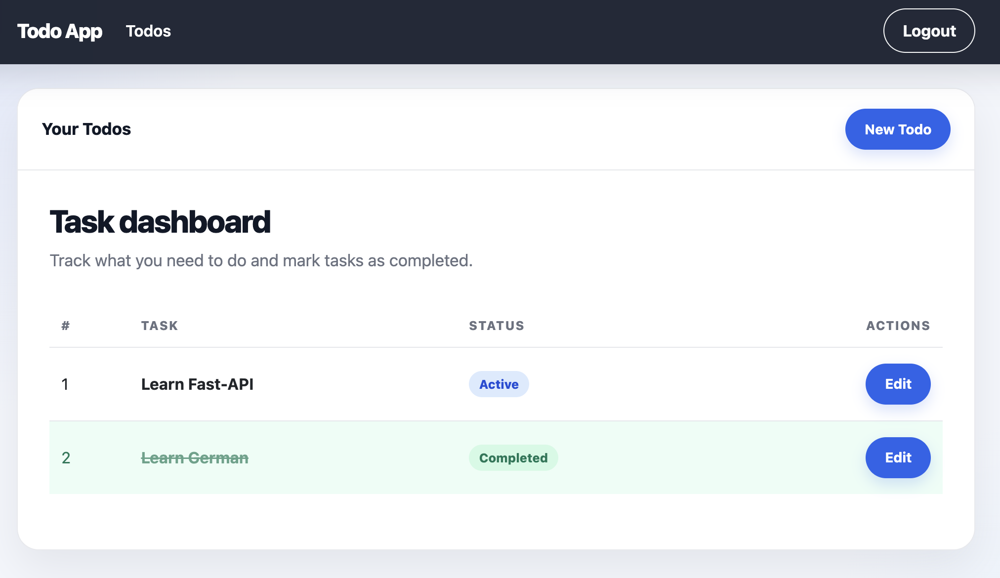

# FastAPI Todo App

> A full-stack task manager with user accounts, JWT authentication, PostgreSQL and a responsive Bootstrap UI.


**[→ Open live demo](https://fastapi-todo-api-4ydt.onrender.com/)**
*(Hosted on Render's free tier — first load may take a few seconds.)*

---

## Screenshots
### Home page



### Todo dashboard


---

## Features

- User registration and login with JWT-based authentication
- Password hashing with bcrypt
- Per-user todo lists — create, update, complete, and delete
- Admin routes with role-based access
- PostgreSQL in production, SQLite fallback for local development
- Alembic database migrations
- Jinja2 templates with a Bootstrap-based responsive UI
- Docker and Docker Compose setup
- Pytest test suite with GitHub Actions CI

---

## Tech stack

| Layer | Tools |
|-------|-------|
| **Backend** | FastAPI · SQLAlchemy · Alembic · Passlib / bcrypt · Uvicorn |
| **Database** | PostgreSQL (production) · SQLite (local fallback) |
| **Frontend** | Jinja2 · Bootstrap · Custom CSS · JavaScript |
| **DevOps** | Docker · Docker Compose · GitHub Actions · Render |
| **Testing** | Pytest |

---

## Project structure

```
FastApi/
├── ToDoApp/
│   ├── routers/          # auth · todos · admin · users
│   ├── static/           # css and js assets
│   ├── templates/        # jinja2 html templates
│   ├── test/             # pytest suite
│   ├── database.py       # db configuration
│   ├── models.py         # sqlalchemy models
│   └── main.py           # app entry point
├── alembic/              # database migrations
├── .github/
│   └── workflows/
│       └── tests.yml     # ci workflow
├── docs/images/          # readme screenshots
├── Dockerfile
├── docker-compose.yml
├── .env.example
├── requirements.txt
└── README.md
```

---

## Getting started

### Option 1 — Docker (recommended)

```bash
# 1. Clone the repo
git clone https://github.com/YMoso/FastAPI-Todo-App.git
cd FastAPI-Todo-App

# 2. Create your .env file
cp .env.example .env

# 3. Generate a secret key and paste it into .env
openssl rand -hex 32
```

```env
SECRET_KEY=your_generated_secret_key
ALGORITHM=HS256
```

```bash
# 4. Start the app and database
docker compose up --build
```

Open `http://localhost:8000` in your browser.

---

### Option 2 — Local (macOS / Linux)

```bash
# Create and activate a virtual environment
python3 -m venv venv
source venv/bin/activate

# Install dependencies
pip install -r requirements.txt

# Set up .env
cp .env.example .env
openssl rand -hex 32   # paste output as SECRET_KEY

# Run the app
uvicorn ToDoApp.main:app --reload
```

Open `http://127.0.0.1:8000` in your browser.

When running locally without Docker the app uses SQLite as a fallback database — no Postgres setup needed.

---

### Option 3 — Local (Windows)

```powershell
# Create and activate a virtual environment
python -m venv venv
venv\Scripts\activate

# Install dependencies
pip install -r requirements.txt

# Set up .env
Copy-Item .env.example .env
python -c "import secrets; print(secrets.token_hex(32))"   # paste output as SECRET_KEY

# Run the app
uvicorn ToDoApp.main:app --reload
```

Open `http://127.0.0.1:8000` in your browser.

---

## Planned improvements

- [ ] Due dates for todos
- [ ] Search, filtering, and sorting
- [ ] Pagination for larger lists
- [ ] Password reset flow
- [ ] User profile settings
- [ ] Improved admin role management
- [ ] Better frontend error messages and form validation
- [ ] API documentation examples
- [ ] Production-ready logging
- [ ] Improved Alembic migration workflow
- [ ] More tests for auth, permissions, and todo ownership

---

## Author

**Yuriy Mosorov** · [github.com/YMoso](https://github.com/YMoso)

---

*This project is for learning and portfolio purposes.*
